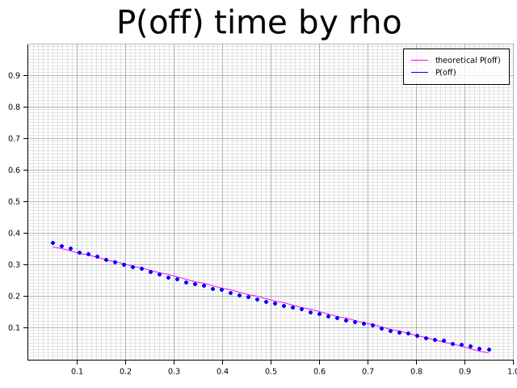
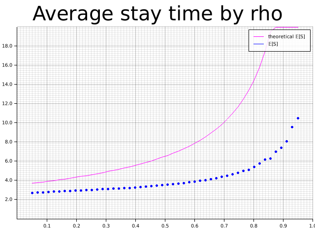
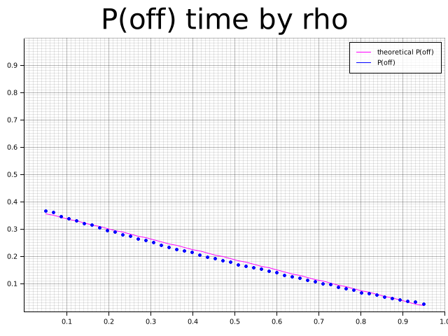

# Queue

Projet du cours de processus stochastiques.

Je suis désolé, je n'ai pas eu le temps de commenter autant que ce que j'aurais voulu.
Je compte le faire dans la journée du 25/08/2021 et pousser ces commentaire sur le [github](https://github.com/latour-gui/queue.git)

## Installation & utilisation

### Rust
Pour compiler ce projet, il est nécessaire d'installer rust.

La commande suivante devrait suffire pour Linux & Mac:
```shell
curl --proto '=https' --tlsv1.2 -sSf https://sh.rustup.rs | sh
```
Sur windows il est possible de passer par des gestionnaires de paquets comme 
[Chocolatey](https://chocolatey.org/install) et d'utiliser la commande `choco install rust`.

### Compiler et lancer le projet

Une fois que rust est installé, il faut se placer dans le dossier contenant le fichier `Cargo.toml` et exécuter la commande suivante:
```shell
cargo run
```

Cette commande va `build` et `run` le projet, c'est à dire récupérer toutes les dépendances, compiler tout et lancer l'exécutable généré.

## Résultats

### Exponentielle





### Erlang





### E[W²]

25.65760339747278

## Auteur

Guillaume Latour < guillaume dot latour at student dot unamur dot be >